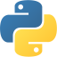
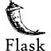
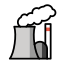

## Fullstack Web Developer

### Hi there 👋 I am Wendy Munyasi.

### About Me
I am just another physicist person who fell for coding. 🙃

### I have experience with:

  

### Nuclear Science 
Apart from doing programming, I like to read nuclear science.

### 🔭 I’m currently working on...
The Google Africa Developer Internship program.

### What I do for fun 😄 
Play cards
Record non-sense videos which I will never dare post anywhere. lol.

### 💬 Ask me about ...
The Goddamn particle.

<!--
**wendymunyasi/wendymunyasi** is a ✨ _special_ ✨ repository because its `README.md` (this file) appears on your GitHub profile.

- 🔭 I’m currently working on ...
- 🌱 I’m currently learning ...
- 👯 I’m looking to collaborate on ...
- 🤔 I’m looking for help with ...
- 💬 Ask me about ...
- 📫 How to reach me: ...
- 😄 Pronouns: ...
- ⚡ Fun fact: ...
-->
